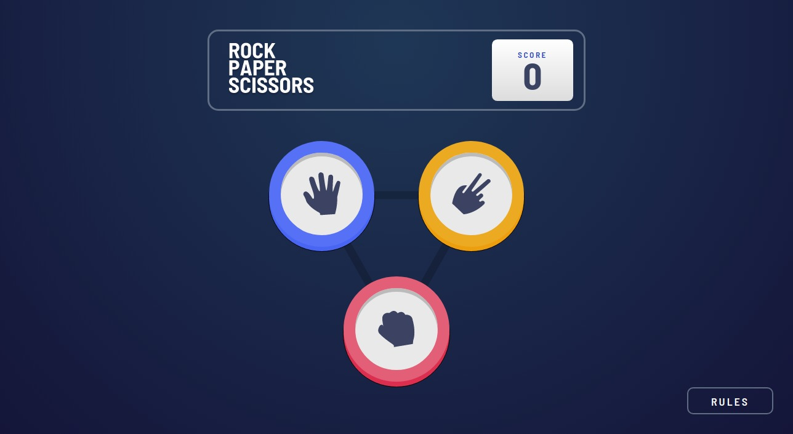

# Frontend Mentor - Rock, Paper, Scissors solution

This is a solution to the [Rock, Paper, Scissors challenge on Frontend Mentor](https://www.frontendmentor.io/challenges/rock-paper-scissors-game-pTgwgvgH). Frontend Mentor challenges help you improve your coding skills by building realistic projects. 

## Table of contents

- [Overview](#overview)
  - [The challenge](#the-challenge)
  - [Screenshot](#screenshot)
  - [Links](#links)
- [My process](#my-process)
  - [Built with](#built-with)
  - [What I learned](#what-i-learned)
  - [Continued development](#continued-development)
  - [Useful resources](#useful-resources)
- [Author](#author)
- [Acknowledgments](#acknowledgments)

## Overview

### The challenge

Users should be able to:

- View the optimal layout for the game depending on their device's screen size
- Play Rock, Paper, Scissors against the computer
- Maintain the state of the score after refreshing the browser _(optional)_
- **Bonus**: Play Rock, Paper, Scissors, Lizard, Spock against the computer _(optional)_

### Screenshot



### Links

- Solution URL: [https://github.com/Cdrn19/rock-paper-scissors](https://github.com/Cdrn19/rock-paper-scissors)
- Live Site URL: [https://cdrn19.github.io/rock-paper-scissors/](https://cdrn19.github.io/rock-paper-scissors/)

## My process

### Built with

- Semantic HTML5 markup
- CSS custom properties
- Flexbox
- CSS Grid
- Mobile-first workflow
- ECMAScript 6
- [Vanilla JS](http://vanilla-js.com/) - JS framework

### What I learned

For this opportunity I loved working with **localstorage** where I learned how to obtain the different values from the explorer.

do this code to get and return updated values from the game:

```html
<div class="header__score">
    <p class="header__score--title">SCORE</p>
    <h1 class="header__score--counter" id="score"></h1>
</div>
```

```js
const score = document.getElementById("score");

localStorageRender();

function localStorageRender(){

    const point = localStorage.getItem("point");

    if( isNaN(point) || point == undefined ){
        localStorage.setItem("point", 0);
        score.innerText = localStorage.getItem("point"); 
    } else {
        score.innerText = localStorage.getItem("point"); 
    }

}

function localStorageUpdate(point){
    let localData = []; 
  
    localData.push(point);
    localData.push(parseFloat(localStorage.getItem("point"))); 
    
    const initialValue = 0; 
    let updatePoint = localData.reduce((previusValue, currentValue) => 
        previusValue + currentValue, initialValue
    );

    localStorage.setItem("point", updatePoint);
    score.innerText = updatePoint;

}
```

You can see that it is divided into two types of functions, where one works to obtain the value if it exists, if it does not exist it creates it with the value 0. Another function that is responsible for obtaining the existing value and returning it updated.

In the main section design, use principles of geometry to calculate the measurements for the positions of each of the buttons, which are represented as an equilateral triangle.

```html
<main class="main" id="main">
    <button class="main__button" value="paper">
    </button>
    <button class="main__button" value="scissors">
    </button>
    <button class="main__button" value="rock">
    </button>
</main>
```

```css
.main {
  display: grid;
  justify-content: center;
}

.main__button:nth-child(2) {
  margin-left: calc(8rem * var(--porcentage-mobile));
}

.main__button:nth-child(3) {
  justify-self: center;
  grid-column: 1 / 3;
  margin-top: calc((6.92rem - 1.6rem) * var(--porcentage-mobile));
}
```

In `margin-top` represents the height of the triangle to place it at the bottom

### Continued development

I will keep deeper studies for the layout with animations and uses of keyframe, it is a world to explore that seems fascinating and complex to me, although I use some animation in this section:

```js
for(let i = 0 ; i < 3 ; ++i){
                document.querySelector(`.selection__${player} .selection__button`).innerHTML += 
                `<div class="${"selection__pulse pulse"+[i]}"></div>`;
            }
```

```css
.selection__pulse {
  border-radius: 50%;
  background-color: white;
  position: absolute;
  opacity: 0;
  animation: scale-in 5s infinite;
}

.pulse0 {
  width: calc(24.625rem * var(--porcentage-mobile));
  height: calc(24.625rem * var(--porcentage-mobile));
  z-index: -1;
}

.pulse1 {
  width: calc(30.7812rem * var(--porcentage-mobile));
  height: calc(30.7812rem * var(--porcentage-mobile));
  z-index: -2;
}

.pulse2 {
  width: calc(38.4765rem * var(--porcentage-mobile));
  height: calc(38.4765rem * var(--porcentage-mobile));
  z-index: -3;
}

@keyframes scale-in {
  from {
    transform: scale(0.5, 0.5);
    opacity: 1;
  }

  to {
    transform: scale(1, 1);
    opacity: 0;
  }
}
```
You can see that there are 3 `<div></div>` that are created dynamically in order to give an added animation to the winner of each game.

### Useful resources

- [Stylelint](https://stylelint.io/) - In this project use **stylelint** to maintain conventions and avoid errors.

It was useful for me to add this rule to check the BEM(Block, Element, Modifier) methodology:

```JSON
"selector-class-pattern": [
         "^[a-z][a-z0-9]*(-[a-z0-9]+)*(__[a-z0-9]+(-[a-z0-9]+)*)?( --[a-z0-9]+(-[a-z0-9]+)*){0.2}$",
         {
             "message": "Expected class selector to be BEM methodology"
         }
         ],
```
- [ESlint](https://eslint.org/) - Find and fix problems in JavaScript code.
- [Prettier](https://prettier.io/) - code formatter.

## Author

- Website - [Carlos Revetti](https://cdrn19.github.io)
- Frontend Mentor - [@Cdrn19](https://www.frontendmentor.io/profile/Cdrn19)

## Acknowledgments

I want to give thanks to [Frontend Mentor](https://www.frontendmentor.io/profile/Cdrn19) website for making these projects and its community.
